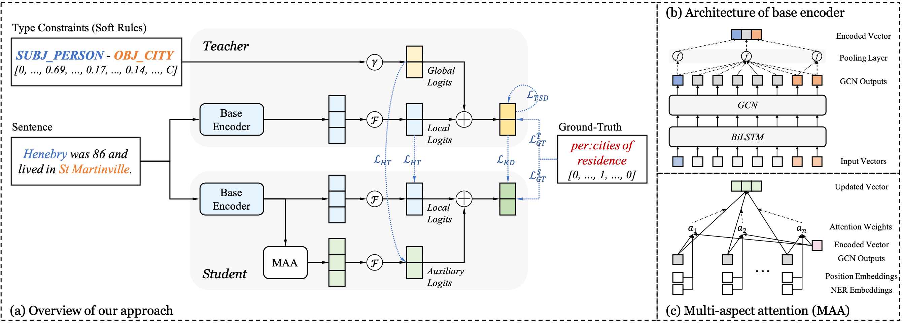

KD4NRE
==========

This repo contains the example pytorch code for the paper [Distilling Knowledge from Well-informed Soft Labels for Neural Relation Extraction](files/AAAI-ZhangZ.7408.pdf). 

This paper/code aims to exhibitions the supervision with soft labels in relation extraction, which makes it possible to integrate prior knowledge. Specifically, a bipartite graph is first devised to discover type constraints between entities and relations based on the entire corpus. Then, we combine such type constraints with neural networks to achieve a knowledgeable model. Furthermore, this model is regarded as teacher to generate well-informed soft labels and guide the optimization of a student network via knowledge distillation. Besides, a multi-aspect attention mechanism is introduced to help student mine latent information from text. In this way, the enhanced student inherits the dark knowledge (e.g., type constraints and relevance among relations) from teacher, and directly serves the testing scenarios without any extra constraints. 

See below for an overview of the model architecture:



## Requirements

- python3 (tested on 3.7.0)
- pytorch (tested on 1.0.1)
- CUDA
- tqdm
- unzip, wget

## Preparation

The code requires that you have access to the TACRED dataset (LDC license required). Once you have the TACRED data, please put the JSON files under the directory `tree_nn/dataset/tacred`. For completeness, we only include sample data files from the TACRED dataset in this repo.

First, construct the bipartite graph (this step can be omitted since we have uploaded the processed file `tree_nn/dataset/pattern/type2prob.json`):

```
cd bipartite
python3 construct.py
cd ../
```

Then, download and unzip GloVe vectors:
```
cd tree_nn
chmod +x download.sh; ./download.sh
```

Next, prepare vocabulary and initial word vectors:
```
python3 prepare_vocab.py dataset/tacred dataset/vocab --glove_dir dataset/glove
```

This will write vocabulary and word vectors as a numpy matrix into the dir `tree_nn/dataset/vocab`.

## Training

First, train a graph convolutional neural network model as base network (we use C-GCN here):
```
python3 train_base.py --id base 
```

Model checkpoints and logs will be saved to `tree_nn/saved_models/base`.


Then, train teacher network with a relation-related weights:
```
python3 train_teacher.py --base_id base --base_mode 2 --id teacher
```

Model checkpoints and logs will be saved to `tree_nn/saved_models/teacher`.

Next, train student network with the guidance of teacher network:
```
python3 train_student.py --teacher_id teacher --base_mode 0 --id student
```

Model checkpoints and logs will be saved to `tree_nn/saved_models/student`.

For simplicity, these models use the same set of parameters in this repo, which could also be adjusted to be optimal respectively. For details on the use of other parameters, please refer to `tree_nn/config.py`. 

## Evaluation

To evaluate the base network on test set:
```
python3 eval_base.py base --dataset test
```

To evaluate the teacher network on test set:
```
python3 eval_teacher.py teacher --dataset test
```

To evaluate the student network on test set:
```
python3 eval_student.py student --dataset test
```

They will use the `best_model.pt` file by default. Use `--model checkpoint_epoch_xx.pt` to specify a model checkpoint file of the `xx` epoch.


## Citation

```
@inproceedings{zhang2020distilling,
 author = {Zhang, Zhenyu and Shu, Xiaobo and Yu, Bowen and Liu, Tingwen and  Zhao, Jiapeng and Li, Quangang and Guo, Li},
 title = {Distilling Knowledge from Well-informed Soft Labels for Neural Relation Extraction},
 booktitle = {Proc. of AAAI},
 year = {2020}
}
```

## Related Repo

Codes are adapted from the repo of C-GCN: [Graph Convolution over Pruned Dependency Trees Improves Relation Extraction](https://github.com/qipeng/gcn-over-pruned-trees).
